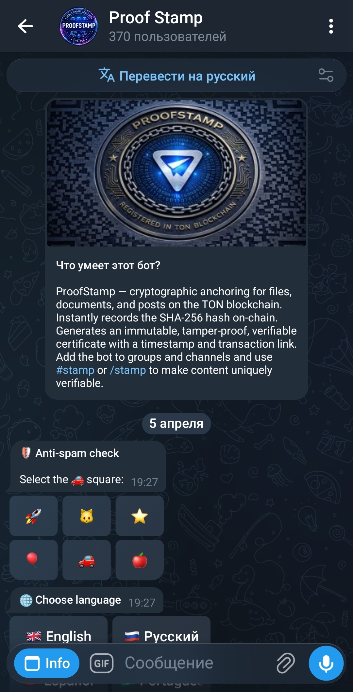
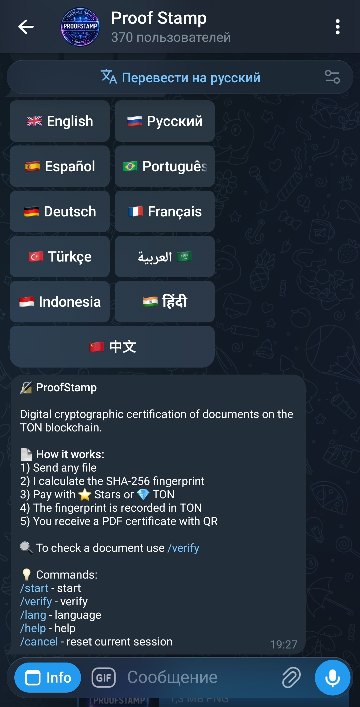
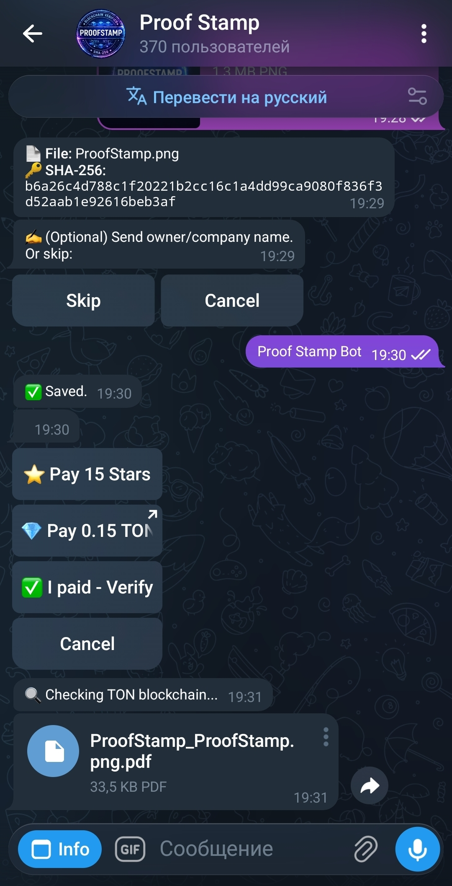
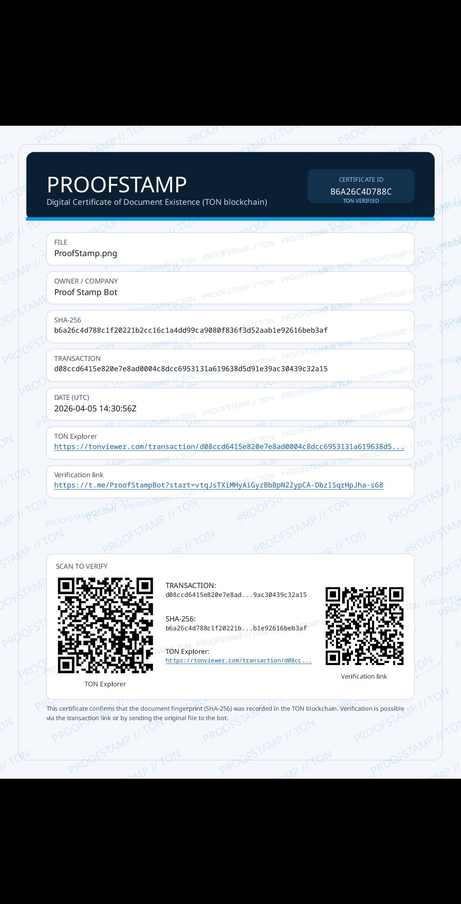

# ProofStamp Bot (Open Source)

<p align="center">
  
  
  
  
</p>

<p align="center">
  <b>Hash it. Anchor it. Prove it.</b>
</p>

ProofStamp is a Telegram bot for cryptographic anchoring on TON.
It records SHA-256 on-chain for files, documents, and posts, then generates a PDF certificate with QR and transaction link.
For group and channel posts, ProofStamp can save proof only or proof together with the full original post text in TON.

Bot: [@ProofStampBot](https://t.me/ProofStampBot)

## Preview

<p align="center">
  
  
  
  
</p>

## Features

- SHA-256 anchoring for files and documents
- Group and channel post stamping
- Optional `Proof + text` mode for posts
- Payment via TON and Telegram Stars
- PDF certificate generation with QR + transaction link
- Multi-language interface

## Quick Start

```bash
npm ci
cp .env.example .env
# edit .env
npm run build
npm run start
```

## Required Environment

Create `.env` based on `.env.example` and set real values.

Required:

- `BOT_TOKEN` - Telegram bot token
- `TON_SIGNER_MNEMONIC` - 24-word mnemonic for signer wallet (Wallet V5R1)

Recommended:

- `TONCENTER_API_KEY` - better reliability / rate limits
- `TON_NETWORK=mainnet|testnet`

## On-Chain Comment Format

Standard file/document proof:

```text
ProofStamp
SHA256:<64-hex>
```

Post proof with full text:

```text
ProofStamp
Post SHA256:<64-hex>
Text SHA256:<64-hex>

Post text:
<original post text>
```

## SHA-256 Integrity

- Current release archive: `releases/proof-stamp-bot-oss-v1.1.0.zip`
- Repository checksums: `FILES_SHA256.txt`
- Release checksums: `RELEASE_CHECKSUMS.txt`
- `FILES_SHA256.txt` is generated from raw file bytes in the checked-out repository and excludes itself to avoid recursive mismatch

## Security Notes

- Do not commit `.env`, mnemonics, API keys, or private keys
- Runtime data and logs should stay outside git history

## Donate

- TON: `pointoncurve.ton`
- BTC: `1ECDSA1b4d5TcZHtqNpcxmY8pBH1GgHntN`
- USDT (TRC20): `TSWcFVfqCp4WCXrUkkzdCkcLnhtFLNN3Ba`

## Disclaimer

This repository is provided as a reference implementation only.

- No active development is planned
- No support or issue handling is guaranteed
- Pull requests may be ignored or declined

Feel free to fork, modify, and use it for your own purposes.

## License

MIT License. Full text is in [LICENSE](LICENSE).
